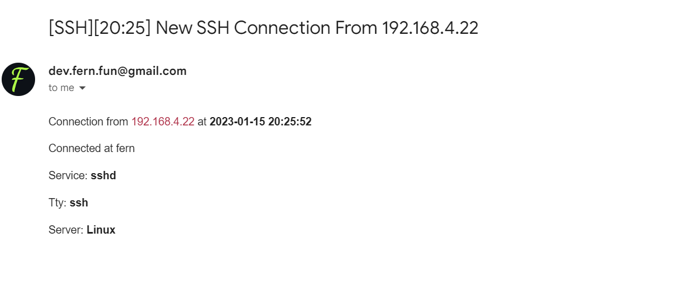

<h1 align="center">ssh-alert</h1>

<div align="center">

[](https://github.com/MrJacob12/ssh-alert/issues)
[](/LICENSE)

</div>

<!-- ## 📝 Table of Contents -->
<!-- -  -->
<!-- - [Deployment](#deployment) -->
<!-- - [Usage](#usage) -->
<!-- - [Getting Started](#getting_started)
- [Built Using](#built_using) -->

- [🧐 About ](#-about-)
- [🏁 Getting Started ](#-getting-started-)
  - [Installing](#installing)
- [⛏️ Built Using ](#️-built-using-)
- [📝 License](#-license)
- [✍️ Authors ](#️-authors-)

## 🧐 About <a name = "about"></a>

ssh alert is a simple tool to alert you when someone is trying to login to your server via ssh.


## 🏁 Getting Started <a name = "getting_started"></a>

### Installing

```bash
git clone https://github.com/MrJacob12/ssh-alert
```

```bash
cargo build --release
```

Run app as root

```bash
sudo ./main
```

First run create config file into `/etc/ssh-alert/config.yml`
Fill this conifg:

```yaml
smtp_server: smtp.gmail.com
username: Username to google.smtp
password: Password to google.smtp
from: Email from
to: Email to send alert
path: Path to ssh-alert executable file
```

Second run as root create pam script to handle success login. If you want to change path to executable file after second run, you need to change path in `/etc/pam.scripts/ssh_alert.sh`

## ⛏️ Built Using <a name = "built_using"></a>

- [Rust](https://www.rust-lang.org/)

## 📝 License

This project is [MIT](https://github.com/MrJacob12/ssh-alert/blob/master/LICENSE) licensed.

## ✍️ Authors <a name = "authors"></a>

- [@MrJacob12](https://github.com/mrjacob12)
